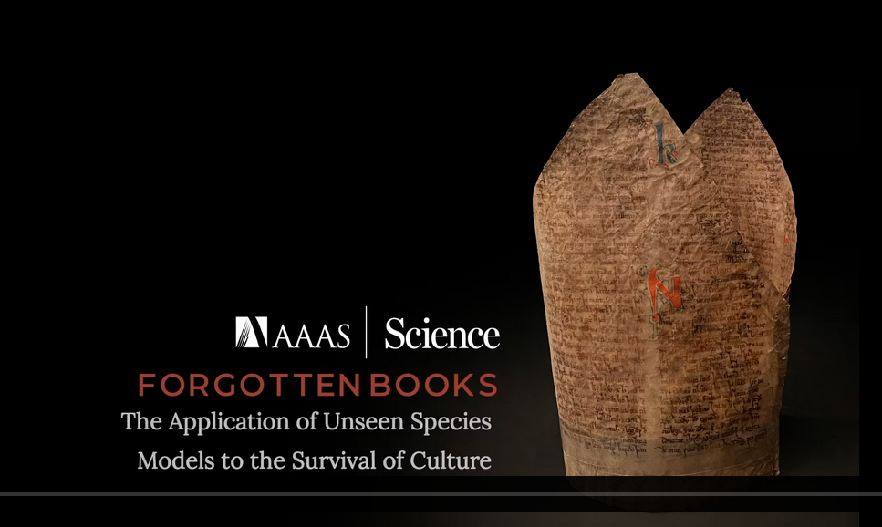

# Le Modèle des Espèces Non Vues Appliqué à la Littérature Chevaleresque Ibérique


## Description

Ce dépôt contient le travail effectué dans le cadre d'un mémoire de Master en Humanités Numériques intitulé **"Le modèle des espèces non vues appliqué à la littérature chevaleresque dans la Péninsule Ibérique"**. Ce projet explore des méthodes quantitatives et computationnelles pour estimer la richesse et la diversité des textes médiévaux, en utilisant des modèles statistiques adaptés.

Ce projet de recherche s'inspire de l'article ["Forgotten Books: The Application of Unseen Species Models to the Survival of Culture"](https://github.com/mikekestemont/forgotten-books), coécrit par [Mike Kestemont](https://mikekestemont.github.io/) et [Folgert Karsdorp](https://www.karsdorp.io/) (et *al.*), publié dans la revue [Science](https://www.science.org/doi/10.1126/science.abl7655) en 2022. Cet article présente les résultats d'une étude approfondie menée sur la littérature épique et chevaleresque, couvrant six langues différentes.


Une présentation du projet est disponible sur la vidéo explicative ci-dessous :
[](https://vimeo.com/677201737)


Les auteurs de cette étude partent d'un constat : parmi la multitude d'artefacts culturels créés à l'origine, seule une infime partie nous est parvenue. Cela pose une question fondamentale : **comment estimer la quantité d'œuvres qui ont été perdues ?** Afin d'estimer ces pertes quantitativement, les auteurs proposent l'application d'un modèle statistique sur un ensemble de données littéraires.

La richesse et la variété de la production culturelle passée sont souvent sous-estimées, un phénomène que les auteurs définissent comme un **biais de sous-estimation**. Pour corriger ce biais et estimer les pertes culturelles, le **modèle des espèces non observées** est utilisé. Ce modèle, inspiré de l'écologie et plus spécifiquement des études de biodiversité, établit une analogie pertinente entre deux domaines apparemment éloignés.

Dans ce cadre, les œuvres littéraires sont considérées comme des espèces en écologie, et les copies de manuscrits sont comparées à l'observation de ces espèces. Ainsi, le même modèle statistique peut être appliqué pour estimer les pertes. Les auteurs utilisent l'estimateur **Chao1**, nommé en l'honneur de la biostatisticienne [Anne Chao](https://sites.google.com/view/chao-lab-website/brief-cv), pour évaluer combien d'espèces (ou d'œuvres) n'ont pas été observées, en tenant compte du faible nombre d'observations.

En conséquence, les espèces (ou œuvres littéraires) qui existent dans l'ensemble mais qui n'ont pas été observées – désignées par $f0$ – peuvent être calculées. Ce calcul repose sur le nombre d'espèces observées une seule fois (les singletons) et deux fois (les doubletons) dans un ensemble de taille $n$. À cela, on ajoute les œuvres uniques repérées dans un ensemble de $n$ documents, notées $fSobs$, afin de déterminer la richesse originelle des œuvres. Grâce à cet estimateur, il est possible non seulement de calculer le nombre d'œuvres littéraires perdues, mais également d'estimer la richesse totale initiale d'une population littéraire.

En utilisant cette approche, ce projet vise à apporter une nouvelle compréhension de la diversité et de la transmission culturelle des œuvres médiévales, tout en quantifiant les pertes subies au fil des siècles dans le domaine de la littérature chevaleresque ibérique.

## Contenu
- **/docs/** : Documentation du projet, y compris le mémoire complet et des articles pertinents pour approfondir la compréhension des concepts employés.
- **/data/** : Textes sources et échantillons utilisés pour l'analyse, comprenant des extraits de la littérature chevaleresque ibérique.
- **/notebooks/** : Notebooks pour réaliser les analyses des données. 
- **/outputs/** : Résultats des analyses, comprenant des graphiques et des fichiers de sortie démontrant la diversité estimée et la probabilité de textes perdus.
- **README.md** : Ce fichier, offrant une vue d'ensemble du projet, les objectifs, la méthodologie et les instructions pour répliquer l'analyse.

## Instructions
Pour exécuter les scripts, veuillez installer les dépendances listées dans `requirements.txt`. Exécutez les notebooks dans `/notebooks/` pour répliquer les analyses. 
Le code utilisé dans ce travail a été repris du dépôt du projet [Forgotten Books](https://github.com/mikekestemont/forgotten-books), qui s'appuie largement sur le package open-source [copia](https://github.com/mikekestemont/copia), co-développé par **Mike Kestemont** et **Folgert Karsdorp**. Pour plus d'information, consulter la [documentation](https://copia.readthedocs.io/en/latest/intro.html).

```sh
>>> pip install copia
```


## Contributions
Les contributions sont les bienvenues, qu'il s'agisse d'ajouter de nouveaux textes au corpus ou de fournir des retours sur le travail effectué.

## Auteurs
- [Carolina Macedo](https://sorbonne.academia.edu/CarolinaMacedo), sous la direction de [Jean-Baptiste Camps](https://github.com/Jean-Baptiste-Camps) et [Frédéric Duval](https://www.chartes.psl.eu/annuaire/frederic-duval).

## License
Ce travail est sous licence **Creative Commons Attribution - Partage dans les Mêmes Conditions 4.0 International**.

Pour plus d'informations, consultez le texte complet de la licence ici : [Creative Commons Attribution - Partage dans les Mêmes Conditions 4.0 International](https://creativecommons.org/licenses/by-sa/4.0/deed.fr).


